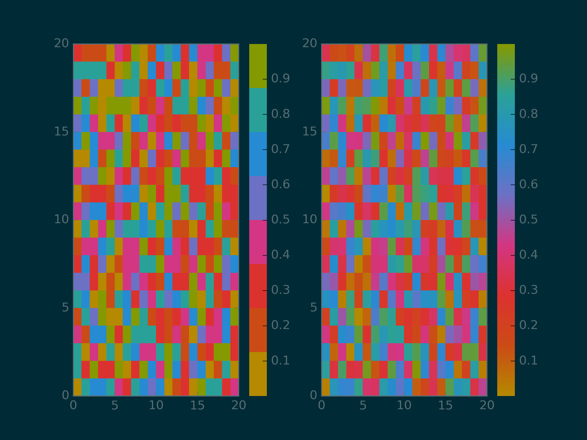

# Solarized python matplotlib colormap
## What is it?
Very simple matplotlib colormaps based on the solarized color palette by [Ethan Schoonover](http://ethanschoonover.com/solarized).

## Requirements
 - matplotlib
 - numpy

## Usage
```python
import solarized
Sol = solarized.Solarized()
cmap = Sol.cmap()
Sol.color2hex('base01')
```

## Example

